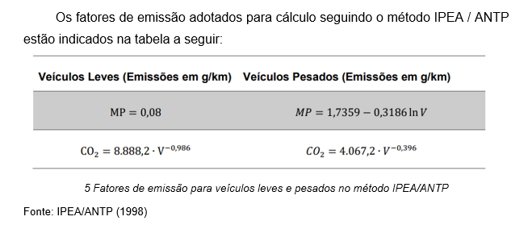

# Pesquisa Origem Destino

Bases de dados Origem

Nota: A base inicial já contempla dados da Pesquisa OD 2017 e projeções da População do IBGE.

A base de dados utilizada para essas etapas do processamento é o arquivo [OD_2017_E_IBGE.xlsx](OD_2017_E_IBGE.xlsx), que é a 
saída do Projeto Integrador IV, que contém os dados da Pesquisa OD de 2017 já tratados e a junção da base do IBGE para o fator de evolução da população.

## Dados InfoSIGA - Painel de Resultados

Os dados de óbitos em acidentes de trânsito foram baixados pela fonte de dados [InfoSIGA](http://painelderesultados.infosiga.sp.gov.br/dados.web/ViewPage.do?name=obitos_publico&contextId=8a80809939587c0901395881fc2b0004).

### Base de Óbitos

O notebook [infosiga_tratamento_dados.ipynb](infosiga_tratamento_dados.ipynb) foi usado para fazer o tratamento dos dados do infosiga antes da junção com a base inicial.

[http://painelderesultados.infosiga.sp.gov.br/bases/obitos_publico.csv](http://painelderesultados.infosiga.sp.gov.br/bases/obitos_publico.csv "Download")

Base de Acidentes Não Fatais

[http://painelderesultados.infosiga.sp.gov.br/bases/acidentes_naofatais.csv](http://painelderesultados.infosiga.sp.gov.br/bases/acidentes_naofatais.csv)

### Base de Acidentes Fatais

[http://painelderesultados.infosiga.sp.gov.br/bases/acidentes_fatais.xlsx](http://painelderesultados.infosiga.sp.gov.br/bases/acidentes_fatais.xlsx)

### Base de Acidentes Fatais Rodoviários

[http://painelderesultados.infosiga.sp.gov.br/bases/acidentes_fatais_rodovias.xlsx](http://painelderesultados.infosiga.sp.gov.br/bases/acidentes_fatais_rodovias.xlsx)

## Emissões ANTP/Ipea

### Enriquecimento de dados por Inferência Matemática

De forma paralela ao enriquecimento de dados por geolocalização, é realizado a inferência de dados a partir de cálculo matemático relacionado a emissão de gases das viagens observadas na Pesquisa OD. 

Para tanto, foi adicionado ao processo de enriquecimento de dados o cálculo de emissão de gases desenvolvido pelo Instituto de Pesquisa Avançada (IPEA) e pela ANTP (Associação Nacional de Transporte Público). Neste método, através do tipo de veículo (Leves e Pesados) e da velocidade desenvolvida, é possível calcular a emissão de gases, e para mérito de simplificação do exemplo deste estudo, foi limitado o cálculo de emissão de Material Particulado (MP) e Dióxido de Carbono (CO2), o primeiro pela sua toxicidade e o segundo por sua significância em estudos ambientais.

Os fatores de emissão adotados para cálculo seguindo o método IPEA / ANTP estão indicados na tabela a seguir:
 

Assim, após realizar o modelo em linguagem Python para inferir novas informações ao banco de dados, é possível atribuir uma quantidade de emissão de gases para cada viagem da Pesquisa OD, conforme será apresentado a diante.

Para elaboração do cálculo em questão, foram feitas duas funções, aplicadas para cada linha do dataframe, de forma a gerar o resultado na coluna "co2_total" e "mp_total".

Primeiro foi necessário criar uma coluna (tipo_veiculo) para identificar o veículo, se moto, leve ou pesado.

Segundo, foi necessário criar uma nova coluna (distancia_km) para identificar a distância em KM.

Terceiro, foi necessário criar uma nova coluna (velocidade_km_h) para identificar a velocidade em KM/H.

O arquivo de saída dessa etapa "OD_2017_E_IBGE_E_ANTP_IPEA.csv" contém as colunas adicionais: 'tipo_veiculo', 'distancia_km', 'duracao_viagem_horas', 'velocidade_km_h', 'co2_total', 'mp_total'.
